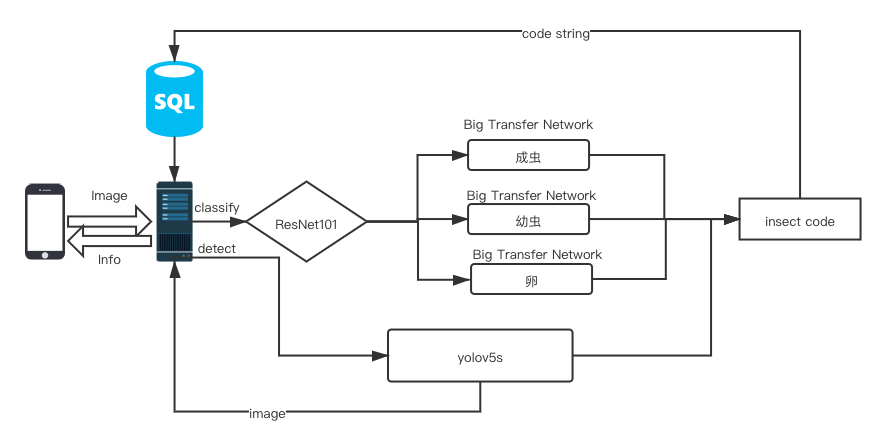
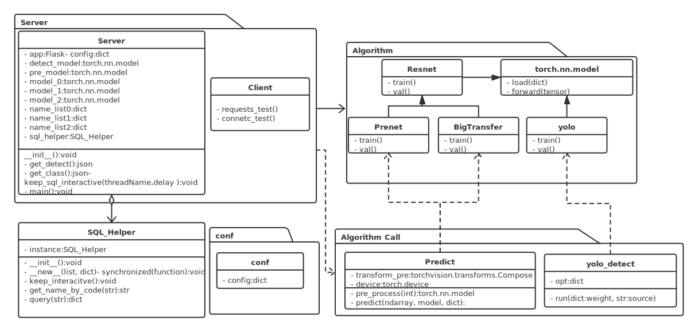
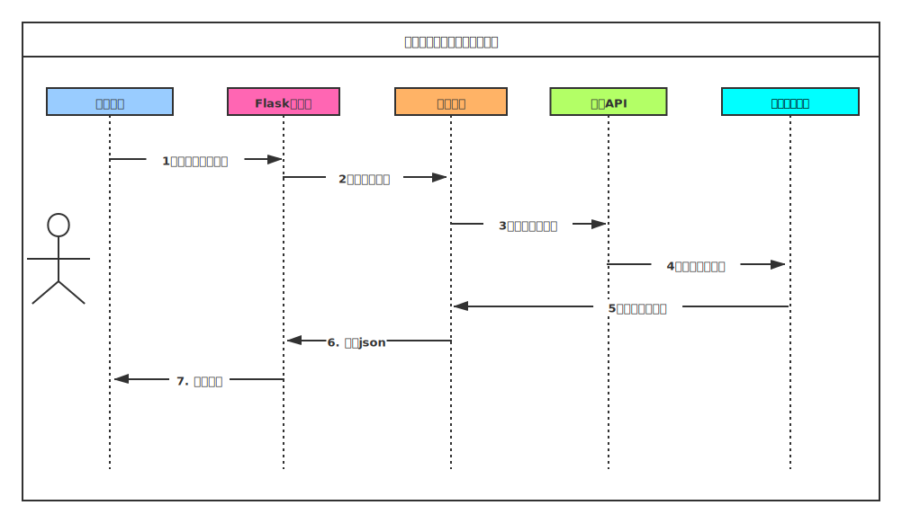

# 设计说明与部署运行
---
# 详细设计说明书

## 1. 引言
### 1.1 编写目的
- 本详细设计说明书是针对林业有害生物识别系统而编写。旨在对该项目进行详细设计，在概要设计的基础上进一步明确系统结构、模块组成的需求，进一步地详细地介绍系统的各个模块以及模型网络结构，是具体实现过程和测试验证实验的基础。
- 本详细设计说明书的预期读者为本项目小组的成员以及对该系统感兴趣以及在以后想对系统进行扩展和维护的人员。

### 1.2 背景
- 林业有害生物识别系统建设是林业有害生物管理信息化的基础工作。其研究起步较早，不少森防部门根据自身工作，建立起相应的系统，但多限于研究阶段，技术方面不很成熟；其应用也是地方的和局部的。依照“预防为主、科学防控、依法治理、促进健康”的方针，实现一种学习成本低，技术透明、使用简单的系统以供林业管理人员以及普通民众使用，能够有效提升人力资源对林业有害生物的预防任务的处理效率；从另一个角度来说，亦能够积极地向普通群众普及相关知识。因此，开发和启动林业有害生物识别系统势在必行且具有极大的应用价值。
### 1.3 定义
- 图像识别：利用计算机对图像进行处理、分析和理解，以识别各种不同模式的目标和对象的技术，是应用深度学习算法的一种实践应用。输入是一张图像，输出是该图像主体内容的类别。

- 图像检测：在图像识别分类的基础上，检测所有对象的位置，置信度。输入是一张图像，输出是所有图像中所包含的所有已知类的对象的类别和位置。
- Mysql：目前最流行的关系型数据库管理系统之一，在 WEB 应用方面，MySQL是最好的 RDBMS (Relational Database Management System，关系数据库管理系统) 应用软件之一。

- Big Transfer(BiT)：Google公司在2020年推出的迁移学习模型，本质是是一组经过预先训练的模型，在新数据集上进行简单的迁移学习就能获得优秀的性能。

- Yolo：一种新的目标检测方法，该方法的特点是实现快速检测的同时还达到较高的准确率。其特点是将目标检测任务看作目标区域预测和类别预测的回归问题。

- Resnet：基于残差学习，并解决了深度CNN模型难训练问题的深度残差网络（Deep residual network, ResNet）。

- Prenet：本项目中自定义名词，是用于识别模式下第一阶段预测害虫的成长阶段所使用的神经网络，由Resnet改编而来。
### 1.4 参考资料
- 《软件工程》 李爱萍，崔冬华，李东生主编 出版社：人民邮电出版社
- 《MySQL：从入门到项目实践》 聚慕课教育研发中心 出版社：清华大学出版社
- 《深度学习》 [美] Ian Goodfellow 出版社：人民邮电出版社
- 《Python深度学习：基于PyTorch》 吴茂贵，郁明敏，杨本法，李涛，张粤磊主编 出版社：机械工业出版社
- 《计算机视觉：模型、学习和推理》 [英] Simon J.D. Prince 出版社：机械工业出版社
- Kolesnikov, A., Beyer, L., Zhai, X. (2019). Big transfer (bit): General visual representation learning. arXiv preprint arXiv:1912.11370, 6(2), 8.
- He K, Zhang X, Ren S, et al. Deep residual learning for image recognition[C] Proceedings of the IEEE conference on computer vision and pattern recognition. 2016: 770-778.
- Kaspereulaers M ,  N  Hahn,  Berger S , et al. Short Communication: Detecting Heavy Goods Vehicles in Rest Areas in Winter Conditions Using YOLOv5[J]. Algorithms, 2021.
## 2. 系统架构
### 2.1 模块描述
- 本系统主要分为三个模块，客户端、服务端以及数据库系统。
  - 客户端主要采用适配主流移动设备的网页访问模式，构建接近原生app用户体验的web app。用户可以选择识别模式或者检测模式，所发出的请求经过服务端响应后得到反馈信息。
  - 服务端包括网络模块、深度学习算法模块、数据库查询模块。网络模块采用Flask监听客户端发过来的请求，经过预处理后将所要识别的图片送入深度学习算法模块进行预测，再将所预测到的昆虫码送入数据库查询模块，得到该类昆虫的详细信息，将这些信息反馈给客户端进行显示。
  - 数据库系统使用MySQL，通过预先建立昆虫信息数据库，配置好各项参数、接口与服务端进行交互。
### 2.2 整体架构


## 3. 详细设计
### 3.1 程序简单描述
- 用户在网页中点击按钮上传本地图片或者拍照，选择所需要识别的图片。选择完毕后，可以选择两种模式，一个是识别模式，一个是检测模式。模式选择完毕后，前端将用户的图片以post方式向指定api进行请求，返回json信息。
  - ***识别模式***：高精度识别单类害虫类别。用户点击识别按钮，前端向服务器发送请求，服务器将图片送入Prenet,该神经网络预测该害虫是成虫、幼虫还是卵；得到害虫的成长阶段后，再送入相应的big transfer中进行类别预测，得到的昆虫码经过数据库查询后得到该昆虫详细信息，然后以json形式反馈给前端进行分页展示，包括实例图片、置信度、名称、种属等，点击查看更多可以返回地区分布、食物等更多信息。
  - ***检测模式***：识别害虫具体位置、数量、类别等信息，**支持多种害虫同时识别**。用户点击识别按钮，前端向服务器发送请求，服务器将图片送入yolov5s，经过opencv处理后框出图中各个害虫的主体的具体位置，置信度，所得到的昆虫码经过数据库查询后得到该昆虫详细信息，然后以json形式反馈给前端进行展示，包括含有检测框的检测结果图、个数信息、名称、种属、地区分布等。

### 3.2 输入输出项
- 输入：一张图片
- 输出：
   - 识别模式下：输出三组识别信息。每组信息包含实例图片、置信度、ORDER_NAME、ORDER_CODE、FAMILIY_NAME、FAMILIY_CODE、GENUS_NAME、GENUS_CODE、INSECT_NAME、INSECT_CODE、LATIN_NAME、FOOD、AREA。
   - 检测模式下：输出一张包含检测信息（目标框、种类、置信度）的图片以及图中每种检测到的害虫的详细信息。包括INSECT_CODE、Nums、ORDER_NAME、FAMILIY_NAME、GENUS_NAME、INSECT_NAME、LATIN_NAME。
   - todo 放一张字段表格
### 3.3 数据集
#### 3.3.1 Prenet网络训练数据集
- 首先，我们制作了一个用于训练前置骨干网络Prenet的数据集。骨干网络目标是先确认输入图片是成虫、幼虫或虫卵。具体数据集信息如下。

| 形态 | 训练集数量 | 测试集数量 | 数据总量 | 原始数据总量 |
| :-----: | :-----: | :-----: | :-----: | :-----: |
| 成虫 | 538 | 280 | 818 | 2366 |
| 幼虫 | 414 | 94 | 508 | 508 |
| 虫卵 | 424 | 20 | 444 | 74 |

- 原始数据量为第一轮收集到的全部训练数据。由于三类比例过于悬殊（约为31:7:1)，考虑到会对Prenet训练结果产生影响，因此我们以幼虫数据量为基准来调整数据集比例。具体操作方式为：保持幼虫数据量不变，人工清洗成虫数据集，将其中低质量图片删去，同时对虫卵做旋转翻转等人工数据增强，使最终数据总量比例保持平衡。由于成虫在自然界中更为常见，因此测试集中通过随机筛选，加入了更多种类的测试样本。

#### 3.3.2 BiT分类网络训练数据集
- 对于分类识别任务，我们分别制作了成虫、幼虫、虫卵三个数据集。其中，成虫数据集包含了提供的林业有害生物表格中的全部99类害虫，幼虫包含了较为常见的54类，虫卵则包含能够收集到的全部14类。具体数据集信息如下。

| 形态 | 类别数 | 训练集数量 | 测试集数量 | 数据总量 | 单类最少样本量 | 单类最多样本量 |
| :-----: | :-----: | :-----: | :-----: | :-----: | :-----: | :-----: |
| 成虫 | 99 | 2023 | 286 | 2309 | 2 | 65 |
| 幼虫 | 54 | 588 | 99 | 687 | 2 | 45 |
| 虫卵 | 14 | 63 | 15 | 78 | 1 | 8 |

#### 3.3.3 YOLO目标检测网络训练数据集
- 我们收集了最常见的15类害虫成虫图片，逐一进行人工标注，标注格式为YOLO数据格式。具体数据集信息如下。

| 形态 | 训练集数量 | 测试集数量 | 数据总量 | 单类最少样本量 | 单类最多样本量 |
| :-----: | :-----: | :-----: | :-----: | :-----: | :-----: |
| 成虫 | 1353 | 45 | 1398 | 28 | 102 |

### 3.4 算法
#### 3.4.1 Prenet
- 模块描述：该模块作为BiT的前序连接模块，先对输入图片进行一个预分类，主要采用ResNet50的网络架构，将输出层神经元数量改为3，可以预先将输入图片分类为成虫、幼虫、虫卵中的一个，然后送入后序BiT中进行类别细分。模型训练和预测的速度都非常快。
- 功能：将输入图片分类，检测图片中的害虫是成虫、幼虫还是虫卵。
- 性能：最终的mAP达到98.4%，单张图片预测速度在50ms左右。
- 网络结构：采用ResNet50，将输出层维度改为3。
- 限制条件：无。

#### 3.4.2 BiT
- 模块描述：该模块先通过上游大规模数据集训练，然后可以迁移到下游分类任务上。在上游训练时，采用大规模数据集和大骨干架构进行预训练。将预训练得到的BiT模型迁移到下游害虫分类任务时，可以得到很高的性能。上游预训练模型通过ImageNet21k数据集训练得到，该预训练模型分别迁移到我们的成虫、幼虫、虫卵三类中，最终得到三个性能优秀的BiT，分别用于对害虫的三种形态做分类。
- 功能：根据Prenet给出的害虫形态标签，选取对应的BiT进行预测，可以直接得到害虫类别。
- 性能：每个类仅需要少量样本即可达到极其优秀的分类性能。在我们的测试集上，成虫分类准确率达到93.36%，幼虫分类准确率达到90.15%，虫卵由于数据数量过少，因此将全部数据用于训练，不计算最终准确率。单张图片预测速度在100ms左右。
- 网络结构：BiT-M-R101x1
- 限制条件：BiT会根据前序Prenet的结果选择调用，因此需要Prenet提供较为精确的类别输出。

#### 3.4.3 YOLO
- 模块描述：该模块利用YOLOv5的轻量性，训练速度和预测速度都比较快。在我们的数据集上，仅需要训练60分钟左右即可达到0.95左右的mAP。模型预测时，可以直接将输入图片中的全部害虫检测出来，并返回害虫的位置、置信度、个数等信息。
- 功能：接收一张待检测图片，将图片中的害虫用不同颜色的矩形框框出，同时给出置信度和个数等信息。
- 性能：训练150个epoch后，mAP@.5达到0.95，单张图片预测速度在50ms左右。
- 网络结构：将输入引入Focus模块，交替连接CBL与CSPNet，同时在网络中间层引入残差连接。
- 限制条件：当输入图片分辨率较低时，会对最终准确率有一定影响。

### 3.5 服务端
#### 3.5.1 模块描述
- 将所要识别的图片送入深度学习算法模块进行预测，再将所预测到的昆虫码送入数据库查询模块，得到该类昆虫的详细信息，将这些信息反馈给客户端进行显示。
#### 3.5.2 功能
- 监听请求，并将请求数据交给算法模块进行处理
- 算法调用，根据请求类型调用相应深度学习算法得到关键信息
- 数据库查询，通过给定关键字段向数据库发出查询请求，得到详细结果信息

#### 3.5.3 模块结构

#### 3.5.4 逻辑流程



### 3.6 前端
#### 3.6.1 功能设计
- 上传图片
  - 用户点击照相机图标，可以选择使用本地图库照片或者在线拍摄图片
- 选择模式
  - 点击「识别文件」按钮即为选择图像识别模式，返回单类害虫检测信息，识别准确率高，一共返回三组可能的害虫信息，按照置信度从高往低排列，带有实例图片，用户可以自行比对和判断。
  - 点击「检测害虫」按钮即为选择图像检测模式，返回一张包含检测信息（目标框、种类、置信度）的图片以及图中每种检测到的害虫的种类、数量等详细信息。
- 结果展示
  - 采用可滑动的窗口展示信息，用户可以左右来回滑动，具体可以见《用户使用手册》
  - 点击「更多信息」按钮可查看关于该类害虫的更多信息，如地区，食物等。
#### 3.6.2 界面设计
- 详情见《用户使用手册》
### 3.7 数据库设计
#### 3.7.1 版本
- MySQL 5.7.32 

#### 3.7.2 INSECTS表
- 具体内容如下所示


| 序号 | 字段名 | 类型 | 长度 | 默认值 | 允许空 | 主键 | 外键 |说明|
| :-----: | :-----: | :-----: | :-----: | :-----: | :-----: |:-----: | :-----: | :-----: |
| 1 | ORDER_NAME | char | 16 |  '' | ✓ | | | 目名称 |
| 2 | ORDER_CODE | char | 16 |  '' | ✓ | | | 目代码 |
| 3 | FAMILIY_NAME | char | 20 |  '' | ✓ | | | 科名称 |
| 4 | FAMILIY_CODE | char | 16 |  '' | ✓ | | | 科代码 |
| 5 | GENUS_NAME | char | 20 |  '' | ✓ | | | 属名称 |
| 6 | GENUS_CODE | char | 16 |  '' | ✓ | | | 属代码 |
| 7 | INSECT_NAME | char | 30 |  '' |  | | | 虫害名称 |
| 8 | INSECT_CODE | char | 16 |  '' |  | ✓| | 虫害代码 |
| 9 | LATIN_NAME | char | 80 |  '' | ✓ | | | 拉丁名称 |
| 10 | FOOD | TEXT | 动态 |  '' | ✓ | | | 食物 |
| 11 | AREA | TEXT | 动态 |  '' | ✓ | | | 分布地区 |


#### 3.7.3 部署
- 支持本地一键构建数据库，source sql_scripts.sql
### 3.8 项目配置文件
```yaml
  # 数据集相关信息
  dataset:
    classes_0: 99 #成虫可预测种类
    classes_1: 54 #幼虫可预测种类
    classes_2: 14 #卵可预测种类
    class_name_0: './conf/classname_0.txt' # 成虫类名集合
    class_name_1: './conf/classname_1.txt' # 幼虫类名集合
    class_name_2: './conf/classname_2.txt' # 卵类名集合
    train_path: '/home/sk49/new_workspace/dataset/2021SoftBei/A4-basebone_balanced' #训练集目录
    val_path: '/home/sk49/new_workspace/dataset/2021SoftBei/A4-basebone_balanced/val' # 验证集目录
    test_path: None # 测试集目录
    lib_path: '/home/sk49/new_workspace/dataset/ 2021SoftBei/A4' # 实例图片库

  model: #big transfer模型参数
    path_0: './ckpts/BiT-cheng.pth'
    path_1: './ckpts/BiT-you.pth'
    path_2: './ckpts/BiT-luan.pth'
    size: 480

  pre_model: #prenet 模型参数
    path: './ckpts/prenet_model.pth'
    size: 224

  GPU: # 指定GPU设备号
    CUDA_VISIBLE_DEVICES: '2'

  server: #Flask 服务器配置
    ip: '0.0.0.0'
    port: 5002
    method: 'POST'

  mysql: #数据库相关
    config: #配置参数
      host: "localhost"
      port: 3336
      user: "root"
      password: "sk49"
      db: "testdb_sk49"
      charset: 'utf8mb4'

    parameters: #编码参数
      charset: "utf8mb4"
      collate: "utf8mb4_unicode_ci"

    fileds: #数据库表字段
      INSECTS:
        - ORDER_NAME
        - ORDER_CODE
        - FAMILIY_NAME
        - FAMILIY_CODE
        - GENUS_NAME
        - GENUS_CODE
        - INSECT_NAME
        - INSECT_CODE
        - LATIN_NAME
        - FOOD
        - AREA

  ```
### 3.9 性能
- 响应时间：整体网络模型预测速度为100ms左右。
- 运行时间：服务器全天候在线
- 准确率：Prenet的mAP达到98.4%，BiT成虫的准确率达到93.36%，BiT幼虫的准确率达到90.15%，BiT虫卵的准确率由于数据量过少没有实验，YOLOv5的mAP@.5达到95%
- 便捷性：由于没有公网IP，目前我们自己部署在内网中。如果有公网IP即可部署至公网，随时随地可以访问，非常便捷。
- 可扩展适应性：对于害虫分类网络，Prenet不需要重新训练，BiT上游任务获得的预训练模型也不需要重新训练，下游分类任务只需要根据数据扩展进行参数微调，微调需要进行1000次迭代，仅需要大约15分钟；对于害虫目标检测网络，YOLOv5需要根据数据扩展进行重新训练，由于其轻量性，训练需要至少100个epoch，仅需要大约45分钟。综上，项目可扩展适应性良好。


## 4. 运行环境
### 4.1 硬件
- CPU: 12 Intel(R) Core(TM) i7-6850K CPU @ 3.60GHz
- GPU: 4块 NVIDIA Corporation GP102 [GeForce GTX 1080 Ti] (rev a1)
### 4.2 软件
- OS: Centos7.5
- MySQL >= 5.7.x
- Anaconda3
- python环境
  - python3.8.10, matplotlib>=3.2.2, numpy>=1.18.5, opencv-python>=4.1.2, Pillow, PyYAML>=5.3.1, scipy>=1.4.1, torch>=1.7.0, torchvision>=0.8.1, tqdm>=4.41.0, tensorboard>=2.4.1, seaborn>=0.11.0, pandas, thop,Werkzeug==2.0.0, Flask==2.0.0, Flask-Cors==3.0.10

---

# 软件环境部署文档

## 服务端
### 软件环境
- OS：linux,可选用cenos7.x或者ubuntu18.04及其以上发行版本
- CUDA 10.1， NVIDIA dirver >= 440.33
- Anaconda3 >= 5.x
- python 虚拟环境（conda环境）
  - python >= 3.8
  - pytorch >= 1.8
  - Flask == 2.0.0
  - Flask-Cors == 3.0.10
  - PyMySQL >= 1.0.2
  - PyYAML >= 5.4.1
  - torch == 1.7.1
  - torchvision = 0.8.2
  - tensorboard >= 2.5.0
  - Werkzeug == 2.0.0
  - 其他软件包根据系统提示可以通过pip安装
- nodejs >= v12.16.2
- MySQL >= 5.7.x

### 硬件环境
- 以下摘自赛题参考指标，该硬件环境满足要求
  - CPU：Intel(R) Xeon(R) Gold 6132 CPU @ 2.60GHz
  - GPU：NVIDIA Geforce RTX2080Ti 11GB GDDR6
  - 内存：32G DDR4 Single-bit ECC
  - SSD：Intel S4510 1.92T
  - HDD：WD 8TB 7200RPM

## 客户端
- 支持市场主流手机，包括安卓手机和苹果手机，通过浏览器访问即可，使用体验接近原生手机app。
- 支持pc端, ipad访问

## 服务器环境部署方法
1. 按照软件环境要求配置基础环境
2. 上传前端源码包project-vue和服务端源码包project-server到服务器
3. 构建数据库
   1. 开启mysql服务，service mysql start
   2. 登陆mysql控制台执行mysql脚本，source sql_scripts.sql,脚本位于服务端源码project-server/Database/sql_scripts.sql
4. 退出mysql控制台,修改配置文件，修改project-server/conf/conf.yaml进行配置
   1. 按照实际情况修改以下数据库配置字段
    ```
        host: "localhost"
        port: 3336
        user: "root"
        password: "sk49"
    ```
5. 新建终端窗口 screen -S project-server
6. 在project-server窗口下，进入配置好的python虚拟环境，进入服务端源码根目录下，执行python3 -m Server.Server
7. 退出但不要彻底结束project-server视窗，新建project-vue视窗 screen -S project-vue
   1. 在project-vue视窗下进入前端源码包
   2. 修改api地址：找到前端源码包project-vuesrc/views/home.vue文件第188行和第222行的ip地址10.1.69.33改为本服务器的公网ip地址，其余不变
   3. 在前端源码包根目录下执行 npm install，然后执行npm run serve
8. 退出但不要彻底结束project-vue视窗


### 使用方法
- pc, ipad或者手机上输入服务器ip地址，端口号8080，即可进入林业害虫识别系统。
- 详情请见Introduction/用户使用手册